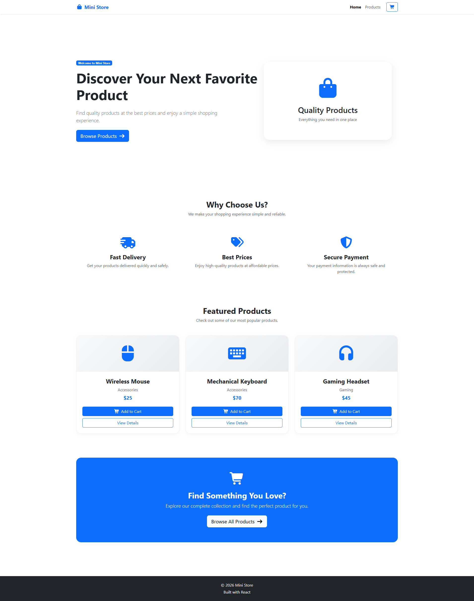

# Mini-Store

A responsive e-commerce frontend built with React.js, featuring product browsing, product details, shopping cart functionality, and client-side routing.

Live Demo: https://ii3boody.github.io/Mini-Store/

## Preview

## Features

- Display a list of products
- View detailed product information
- Add and remove products from the shopping cart
- Automatically calculate the total cart price
- Client-side navigation using React Router
- Responsive design
- Bootstrap-based styling
- Deployment using GitHub Pages

## Technologies

- React.js
- JavaScript (ES6+)
- React Router
- Bootstrap
- HTML5
- CSS3
- Git & GitHub
- GitHub Pages

## Getting Started

### Clone the repository

...
